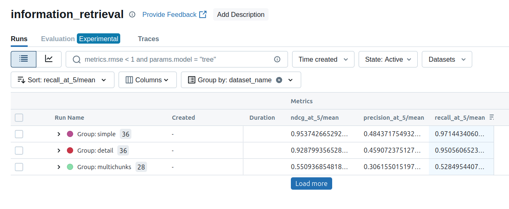
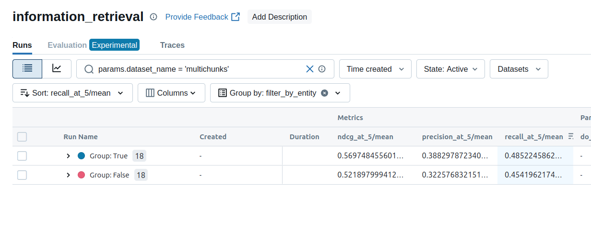
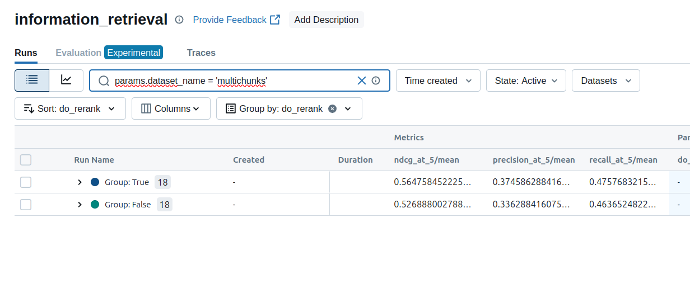
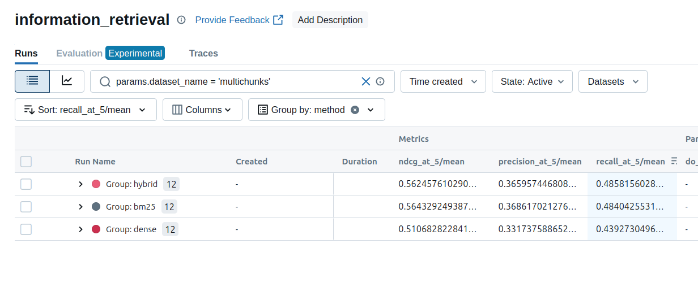

# Répertoire d'expériences

Ce dossier contient différentes expériences liées à l'application RAG développée, notamment :

- L'ingestion des documents (`notebooks/01_ingestion`)
- La création de jeu de données synthétique pour l'évaluation (`notebooks/02_synthetic_data`)
- Des expériences mlflow pour évaluer le *reranking*, le filtre par entité et l'expansion de graph de l'article  [GeAR: Graph-enhanced Agent for Retrieval-augmented Generation](https://arxiv.org/abs/2412.18431) (`notebooks/03_experiments`)
- Évaluation des réponses avec le NLI
- Une méthode pour effectuer des résumés extractifs des articles conditionnés sur une requête/question. Cette méthode remplace le chunking traditionnelle et est appliquée aux articles trop longs dans l'application (`notebooks/conditionnal_extractive_summarization`)

## Installation

```
uv sync
```

## Configuration

Définir la variable d'environnement GOOGLE_API_KEY avec un clés valide.

## Résultats

### Évaluation sur différents datasets

Différents jeux d'évaluation ont été générés avec Gemini est les articles pour évaluer l'IR :

- **Simple:** des questions générées à partir d'un article
- **Détail:** des questions générées à partir d'un article, en focussant sur un détail de l'article (et non l'idée générale)
- **Multichunk:** des questions générées à partir de plus d'un articles (qui parlent de la même entité)



Pour le reste des expériences, le dataset *multichunks* est utilisé.

### Filtre par entités extraites

L'extraction des entités dans la question et l'application d'un filtre pour la recherche améliore la qualité de la recherche.



### Reranking

L'utilisation d'un *cross-encoder* améliore aussi la qualité des documents. Pour cette expérience, on récupère 3*k documents, les *re-rank* et compare les résultats au top-k documents sans re-ranking.



### Comparaison des méthodes de recherche (sémantique, bm25, hybride)

La recherche sémantique est la moins bonne. Les recherches bm25 et hybrides donnent des résultats similaires.


